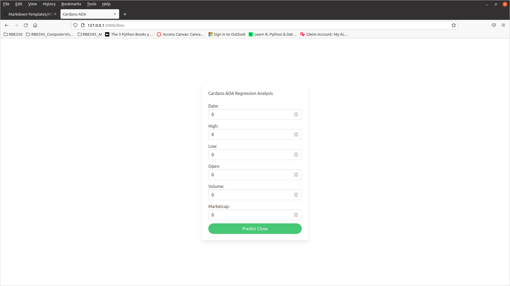
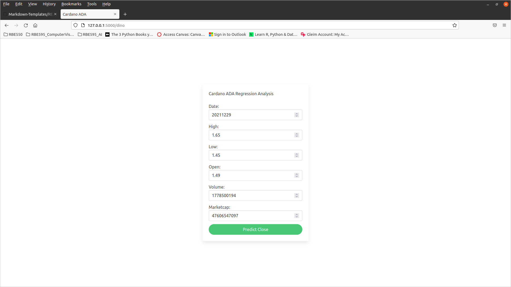
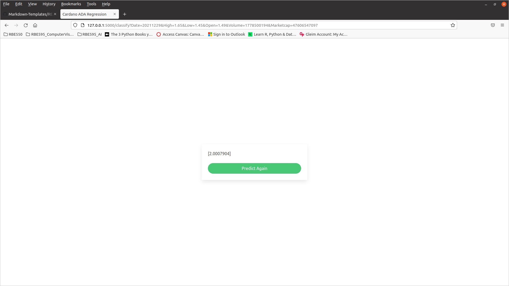
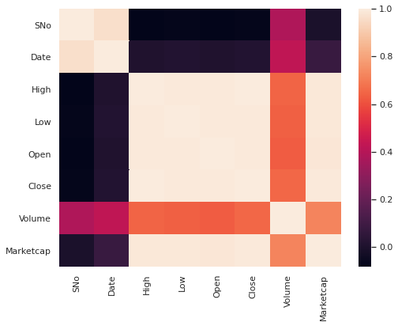
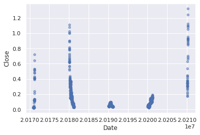
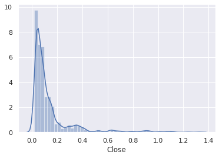
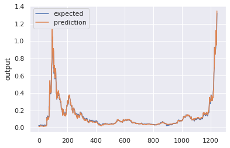
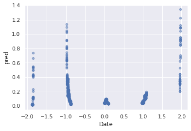

[HITS](https://hits.seeyoufarm.com)
[HITS](https://hits.seeyoufarm.com)
[HITS](https://hits.seeyoufarm.com)

# Cardano ADA Regression Analysis
## Introduction
This repository contains the code for deploying ADA Machine Learning (ML) model using Flask. The goal of this project is for the ML model to predict the Close value of Cardano given Date, Open value, High value, Low value, Marketcap value, and Volume value. We will be using the [*cardano*](https://github.com/prespafree1/Cardano-ADA-Regression-Analysis/blob/main/coin_Cardano.csv) dataset from Kaggle.

## Regression Model
The python file cardano_model.py contains the regression model for this project. First step is to import all the necessary libraries. Three functions are used in total. The first function is **to_xy** which converts a pandas dataframe to the x and y inputs that TensorFlow uses. The second function called **encode_numeric_zscore** encodes a numeric column as zscore. More information regarding [*zscore*](https://deepai.org/machine-learning-glossary-and-terms/z-score) can be found in the hyperlink. 

The **classify** function takes in 6 input parameters (Date, High, Low, Open, Volume, and Marketcap) and outputs the predicted Close value. The csv file is read first by using pandas in the form of a dataframe. Three of the features of columns are dropped (SNo, Name, and Symbol). The Date feature is formatted differently such that only the first part of the date is used without any time (YYYMMDD).The input parameters from the used are added to a second dataframe called df_2. This new dataframe is appended to the original dataframe called df (this action adds df_2 after last row of df). 

If you take a look at the csv file, the Date, Volume, and Marketcap feature values are too large compared to the rest of the features. A very important step in machine learning is data processing and standardization. Zscore is used for the standardization step. You can also try this for yourself. If you let Date, Volume, and Marketcap features the same, your predicted Close value will be some huge value. 

The model used consists of 3 layers. The input layer of 100 nodes, the hidden layer of 10 nodes, and the output layer. Each layer is densely interconnected. More information regarding [*Dense*](https://machinelearningknowledge.ai/keras-dense-layer-explained-for-beginners/) layers can he found in the hyperlink.

An important step is that we make a prediction and then we wrap the last row of the prediction to the user interface. This prediction is an array so it needs to get converted to a string first before it can be displayed to the user interface. 

## User Interface
The figure below depicts the overall webpage design. It is run locally on https://127.0.0.1.5000/dino. User needs to run python server.py on command line and then paste your corresponding link to web browser. 

The picture below depicts a screenshot of the webpage when a user inputs specific values for each input paramenter and just before prediction. 

The picture below depicts the predicted value based on user input values from the picture above.

Please **NOTE**: The web interface code is taken from [*Srishilesh*](https://www.section.io/engineering-education/deploying-machine-learning-models-using-flask/).
Model code copyrights are to **Abedin Sherifi**. 

## Jupyter Notebook Data Analysis
The file called [*cardano.ipynb*](https://github.com/prespafree1/Cardano-ADA-Regression-Analysis/blob/main/cardano.ipynb) is a jupyter notebook file that covers several examples of data analysis of the **coin_Cardano.csv**. 

Images below will display a snapshot of some of the code in the jupyter notebook file.

A heatmap contains values representing various shades of the same color for each value to be plotted. Usually the darker shades of the chart represent higher values than the lighter shade. The varying intensity of color represents the measure of correlation. This is captured in the image below.  

 
The image below is a scatter plot of the Close feature vs. the Date feature.  

 
The image below is a distribution plot of the Close feature.  

 
The image below is a chart regression plot. It plots expected and predicted values and shows the overlap between the two.  

 
The image below is a scatter plot of the predicted values.  

 

https://prespafree1.github.io/Cardano-ADA-Regression-Analysis/
